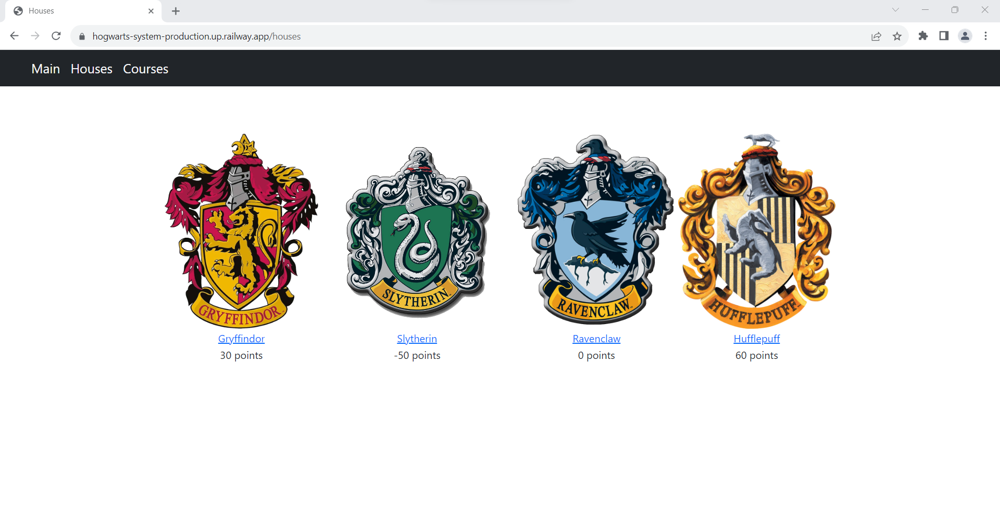

# Hogwarts Student Management System

App available [here](https://hogwarts-system-production.up.railway.app/ "Hogwarts Student Management System").

The purpose of the project is to manage students, courses, and grades at Hogwarts School of Witchcraft and Wizardry. It allows adding students to one of the four Hogwarts houses: Gryffindor, Slytherin, Ravenclaw, or Hufflepuff. Students can be enrolled in courses, and their grades can be tracked, along with the average grade from every course. Additionally, the system allows for the addition, editing, or deletion of courses. Each course has its own page with a list of students and their grades. The system also tracks points collected by students in each house, displaying them on the "Houses" page.

## How to use

Click the link above to view the welcome page.


Click "Houses" in the top navigation bar to access the houses page.



Choose a house and click on it to view the student list or add a new student.


To add a student, fill in the form and click "Add". To delete a student, click the "Delete" button next to their name.


Click "View" next to the student's name to see a Student page. On that page, you can enroll the student in courses. It is also possible to enroll students from the Course page.


The Student page shows all the courses the student is enrolled in, along with grades and the average grade from each course. Click "Courses" in the top navigation bar to view the Courses list.


To add a course click "Add course" button.


Coming back to the courses page, click on the chosen course to see its details.


From that page, you can delete the course by clicking "Delete," update the Code, Name, or description of the course by clicking the "Update" button.


By clicking "Student List", you will be redirected to the Student List page.


It allows you to add or delete students from the course. You can also track their grades, add new ones, and update them by clicking the "edit" link in the "Edit grades" column. This page also allows you to add or subtract points from the houses that students belong to by typing an amount in the last column.


When you click the "edit" link in the "Edit grades" column, you get redirected to a page with only one student and their grades. To delete a chosen grade, select it from the dropdown list and confirm.


## Built with
- Java version 17
- Apache Maven 4.0.0
- Spring Boot 2.7.9

## Running

Go to **/hogwarts** directory and run:

```bash
mvn clean spring-boot:run
```
